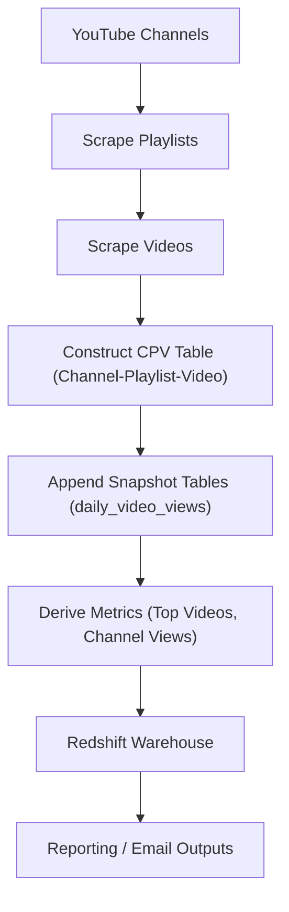

# YouTube Metadata Pipeline

Automated ingestion pipeline for public YouTube channel, playlist, and video metadata, with warehouse upserts and daily derivative reporting.

```yaml
Role: Data Engineering / Analytics Engineering / Digital Content Analytics
Domain: media / social / digital content
Type: ingestion pipeline
Maturity: production (historical artifact)
Stack: Python, Selenium, BeautifulSoup, pandas, Redshift, SMTP automation
Topics: python, etl, ingestion, web-scraping, analytics-engineering, youtube, redshift, relational modeling, data warehouse, automation
Notes:
  - Originally built and maintained as a production pipeline for a media company; preserved here in sanitized form with employer-specific details removed
  - Requires chromedriver and Redshift credentials
  - Not guaranteed to run out-of-the-box
```

This project implements a batch pipeline that:
* Scrapes public YouTube channel, playlist, and video metadata
* Normalizes relationships between channels, playlists, and videos
* Appends daily snapshot data into a Redshift warehouse
* Computes derived reporting tables (e.g., daily views, top videos, channel aggregates)

The code is preserved largely in its original 2016–2018 form, with minimal modifications for clarity and confidentiality.

## Architecture 
In the original production environment, this pipeline was scheduled to run daily via cron, with email notifications for reporting outputs. The architecture can be visualized as follows:

